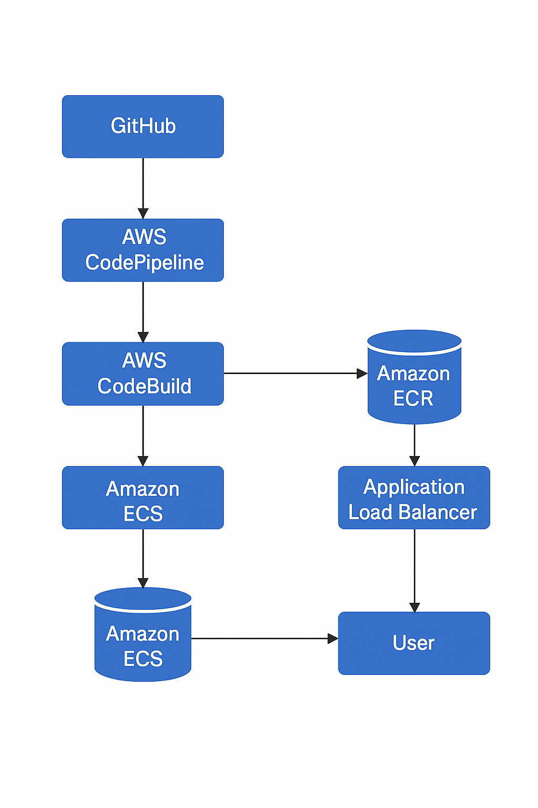

# 🕹️ 2048 Game - CI/CD Pipeline on AWS using Terraform

This project automates the deployment of the classic **2048 Game** using **Docker**, **ECS Fargate**, **CodePipeline**, and **Terraform**. It demonstrates a fully containerized CI/CD setup from GitHub source to AWS deployment using Infrastructure as Code (IaC).

---

## 📌 Project Overview

- **App**: Dockerized 2048 game
- **Source Control**: GitHub
- **CI/CD**: AWS CodePipeline & CodeBuild
- **Container Registry**: Amazon ECR
- **Compute Platform**: AWS ECS Fargate
- **Networking**: Application Load Balancer (ALB)
- **IaC**: Terraform

---

## 📊 Architecture Flow

  
<!-- Replace with the actual path to your image: e.g., `docs/flowchart.png` or hosted link -->

---

## 🚀 CI/CD Flow

1. **Code Commit**: Push code to GitHub repository.
2. **Source Stage**: AWS CodePipeline pulls the latest code via CodeConnection (GitHub OAuth).
3. **Build Stage**:
   - CodeBuild uses `buildspec.yml` to:
     - Build Docker image
     - Tag and push to Amazon ECR
4. **Deploy Stage**:
   - ECS Fargate service updates with new image
   - ALB routes traffic to running container

---

## 🛠️ Setup Instructions

### 🔐 Prerequisites

- AWS CLI configured
- Terraform installed
- GitHub repo with `Dockerfile`, `buildspec.yml`, Terraform code

---

### 📁 Folder Structure

2048-ci-cd-aws/
├── main.tf
├── ecs.tf
├── alb.tf
├── variables.tf
├── buildspec.yml
├── Dockerfile
├── README.md
└── images/
└── flowchart.png


---

### ⚙️ Deployment Steps

```bash
# Step 1: Clone this repository
git clone https://github.com/<your-username>/2048-ci-cd-aws.git
cd 2048-ci-cd-aws

# Step 2: Run the script to apply terraform configurations
./scripts/deploy.sh

# Step 3: Upload the Image to ECR
./scripts/ecr-push.sh

# Step 4: To cleanup the services
./scripts/destroy.sh

✍️ Author
Mohammed Khashif
DevOps & Cloud Engineer


---

Let me know if you'd like the `flowchart.png` image created based on your architecture (I can generate one for you), or if you’d like help converting this into a GitHub-friendly format.
